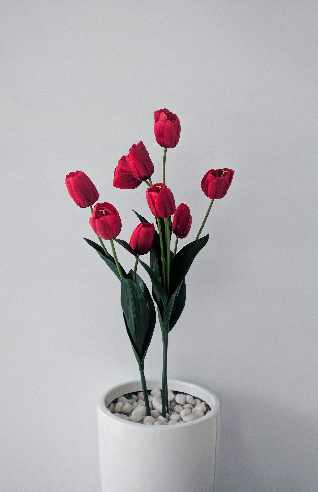
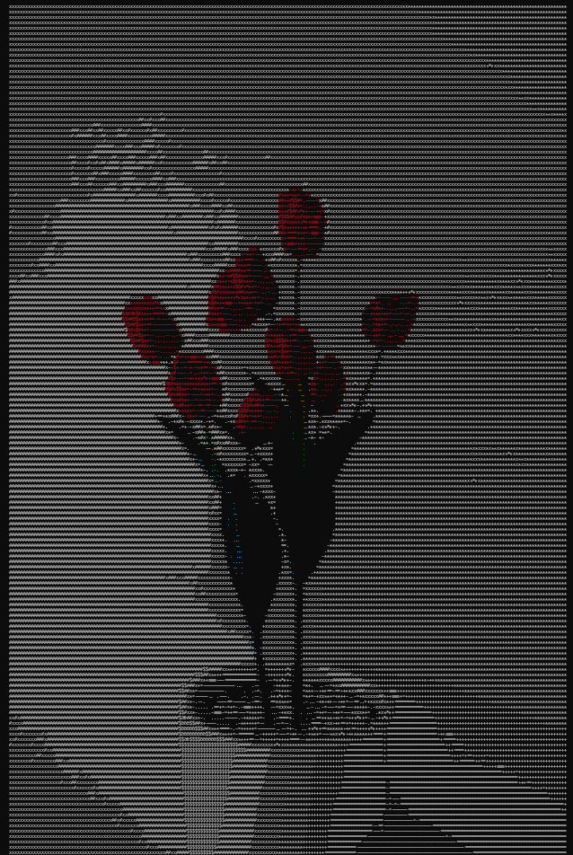

<div align="center">
  
  
</div>


# ascim

A small Rust command-line tool and library for converting images to ASCII art. Useful for quick previews, terminal wallpapers, demos, or embedding simple text-based representations of images.


## Installation
```bash
cargo install ascim
```

## Usage
Basic CLI usage:
```bash
# print image.png to ASCII on stdout
ascim  image.png 

```

As Library
```rust
  use ascim::{AsciImage, Arguments};
    
     fn main() -> Result<(), Box<dyn std::error::Error>> {
         let args = Arguments {
             file_path: String::from("examples/image.png"),
             max_width: 80,
             max_height: 40,
            character_ratio: 2.0,
            edge_threshold: 1.0,
         };
    
         let ascii = AsciImage::from_args(&args);
    
         ascii.print();
    
         Ok(())
     }
```

## Features
- Convert images to ASCII art with configurable width and character set
- Support for color output (ANSI) and plain monochrome output
- Library API for integration into other Rust projects
- Fast, memory-efficient processing using Rust image crates


## Configuration
Common options:
- width: target output width in characters
- color: enable ANSI color output
- charset: character set to use for density mapping
- invert: invert brightness mapping


## Contributing
Contributions are welcome. Open issues for bugs or feature requests and submit PRs for fixes or improvements. Keep changes small and include tests where applicable.

## License
MIT OR Apache-2.0 — see LICENSE file for details.


## Acknowledgements & Inspiration

This project was inspired by and builds upon ideas from the ascii-view project:

- Original inspiration: [gouwsxander/ascii-view](https://github.com/gouwsxander/ascii-view)
- Why it inspired this work:
  - Clear approach to mapping pixel brightness to ASCII density characters.
  - Practical techniques for terminal-friendly resizing and aspect-ratio correction.
  - Useful examples of combining color (ANSI) with character-based rendering.

Credit and differences:
- Credit: many of the algorithmic ideas and mapping choices were inspired by the linked project; thanks to the original author for the clear, educational implementation.
- Differences in ascim:
  - Exposes a small library API (AsciImage / Arguments) for integration in other Rust programs.
  - Adds configurable edge-detection options and slightly different character sets.
  - Focuses on producing compact, publishable crate documentation and examples.

If you'd like your repository acknowledged differently (additional attribution, direct quote, or a link to a specific file/commit), tell me what to include and I'll update this section.